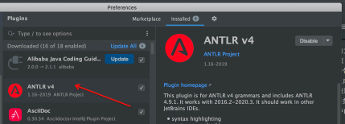
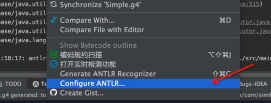
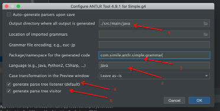
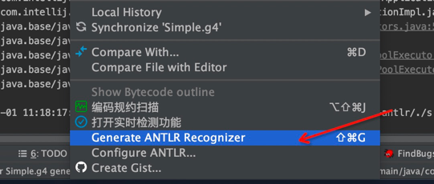

首先在idea中添加插件，如下图所示

编写好g4后，可以右键文件
选择"Configuration ANTLR"，如下图所示

在弹出的页面进行配置编辑，如下图所示

其中：
1）g4生成的文件保存目录路径（相对于项目根目录）
2）生成文件的包名
3）生成文件的类型
4）生成监听类，以监听者模式获取解析中的事件
5）生成访问类，以访问者模式获取解析中的事件

配置好后，我们即可对g4文件进行类文件生成，如下图所示
